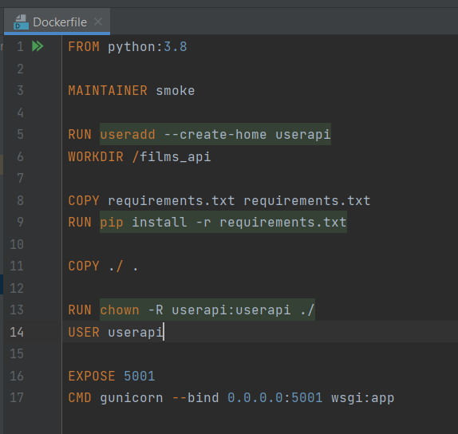
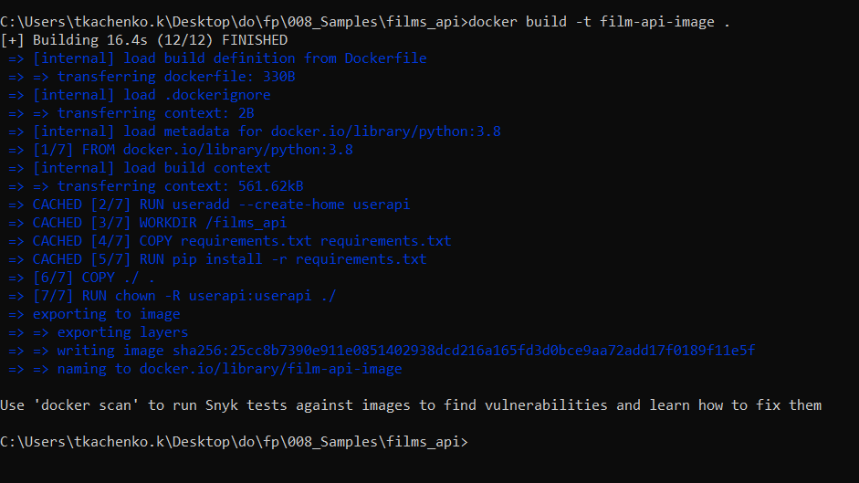
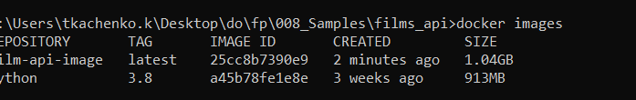
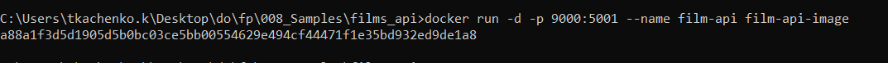
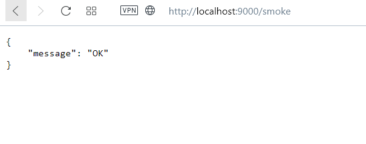
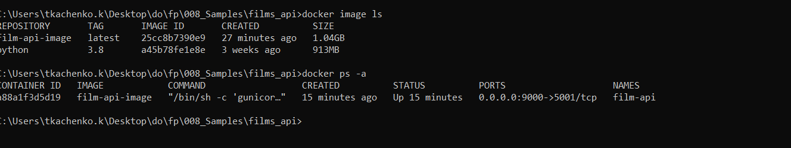
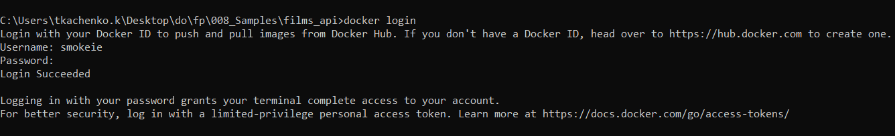
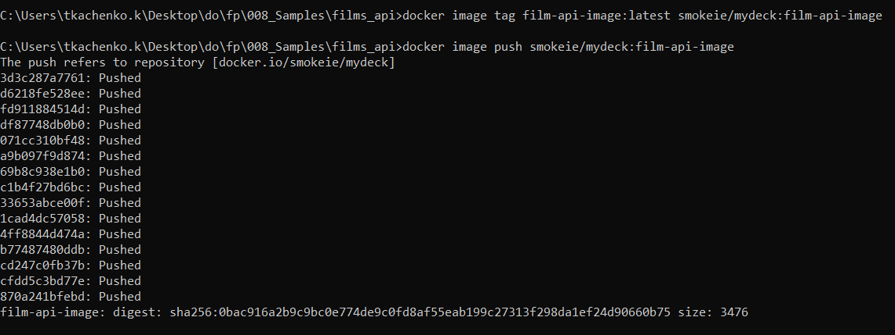
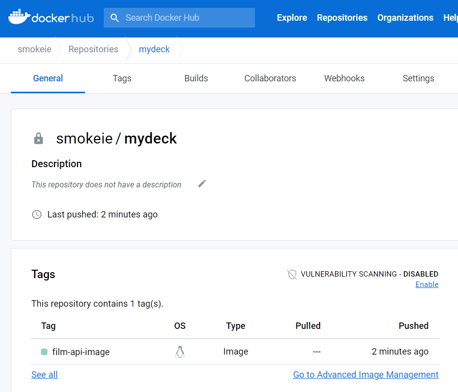

## Create a docker image with Python Flask app

The goal of this task is to create a Docker image which will run my educational Flask app.
  
My educational flask-app is api, that provides some information about films  
  
let's write Dockerfile  
Content of **Dockerfile** file:  
  
  
Building docker image  
  
  
Check out what we have  
  
  
Launch container from the film-api-image image with port forwarding from 5001 to port 9000  
  
  
Open ```localhost:9000``` in the web browser and check out our web application - its working!  
  
  
List all the images and containers that we have by typing ```docker image ls``` and ```docker ps -a``` commands  
  
  
Log in to Docker Hub with ```docker login```  
  
  
Tag and push our image to Docker Hub registry  
  
  
Check on Docker Hub site where our image has been downloaded  
  


