# Jenkins 

## Create the Jenkins pipeline which will deploy my telegram bot in docker to AWS  

Install and unlock Jenkins on my server.  
  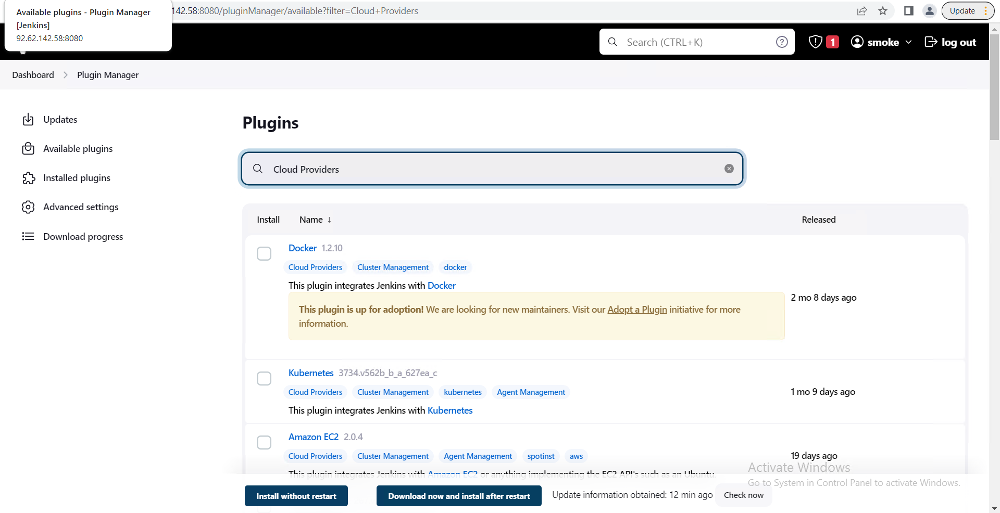  
  
install plugin Pyenv Pipeline to create venv  
  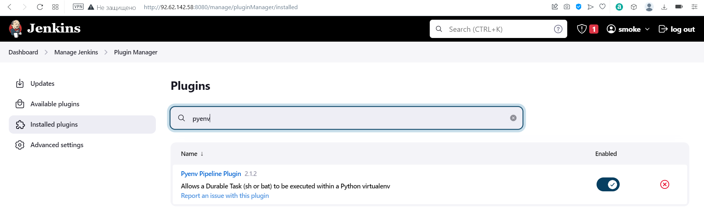  
  
Create pipeline to run my telegram bot (written on python, private repository on github)  
  It’s not a proper pipeline, because after running it will be working, until break, so it must be refactored to run in a docker 
  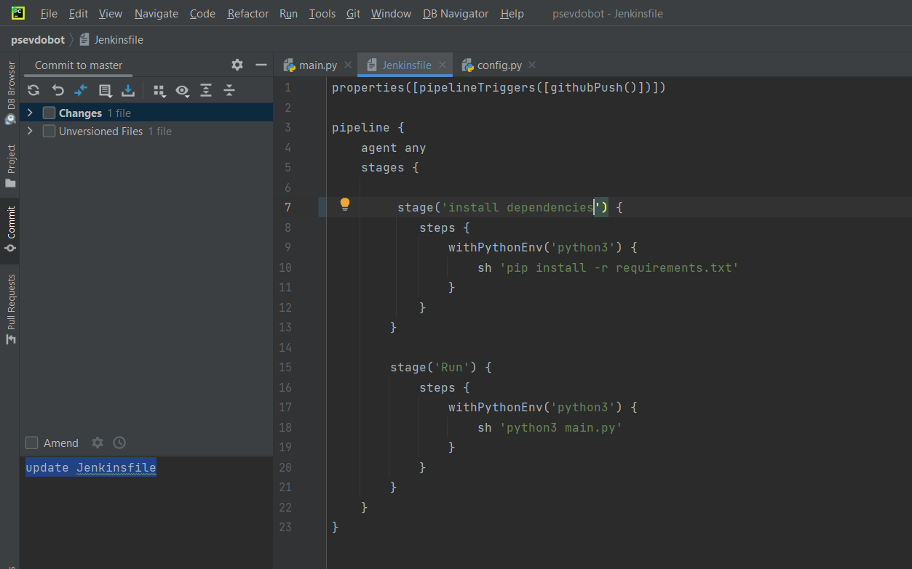  
  
Create pipeline item in Jenkins  
  connect it to the github repository, get Jenkinsfile from the repository as well. Connect with token  
  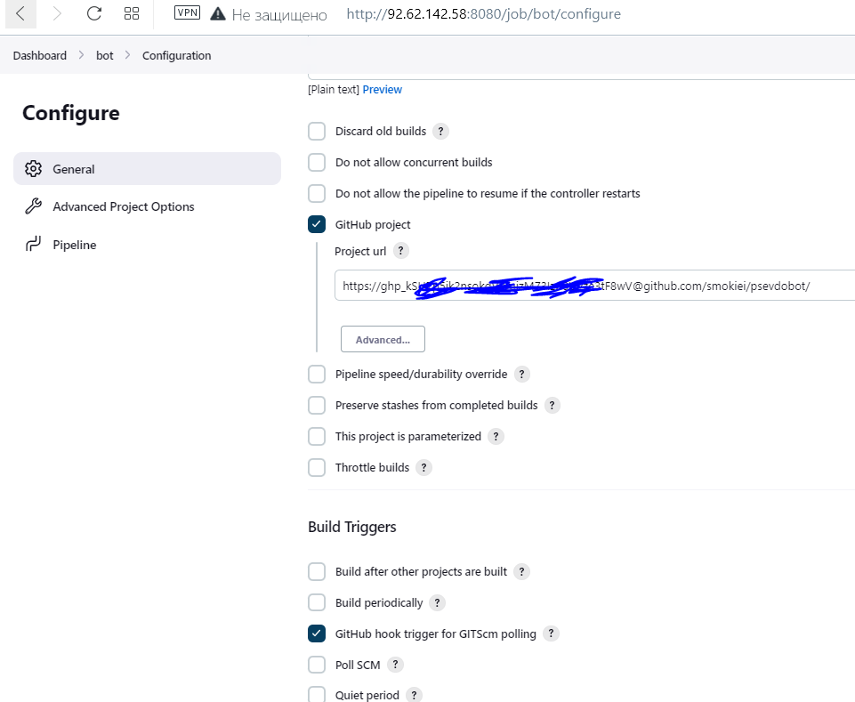  
  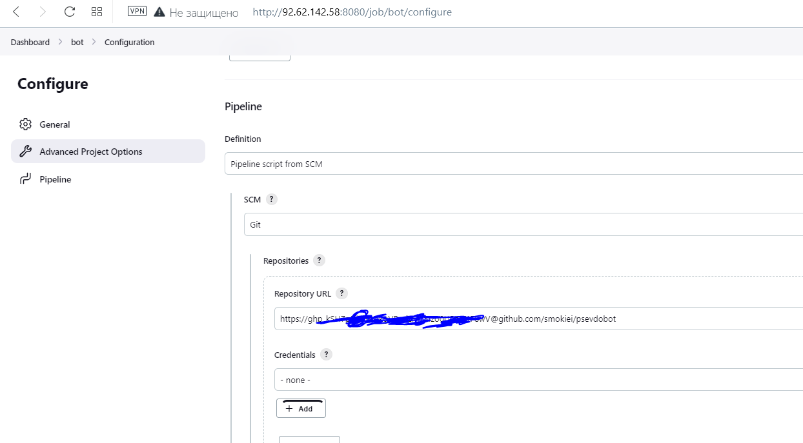  
  
Configure webhook to allow Jenkins to be notified when pushes happen  
  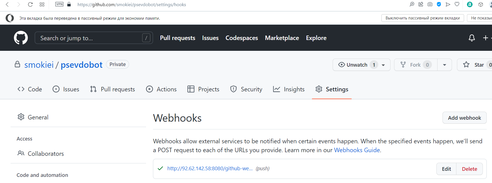   
  
Do some changes, commit them and push to github. Check what happens. Great! It works!
  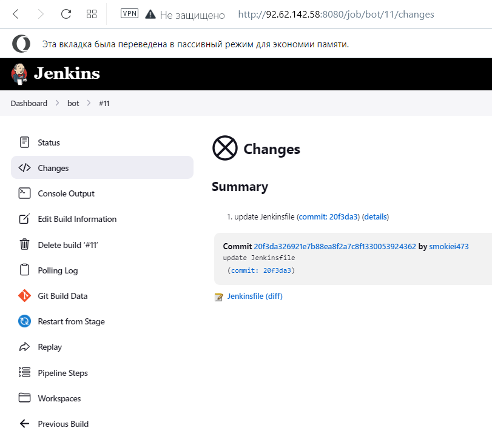  
  
Ok let’s run an application in docker. Create Dokerfile  
  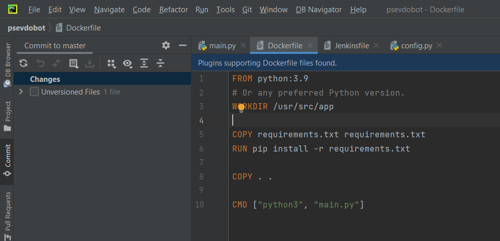  
  and do some refactoring with Jenkinsfile  
  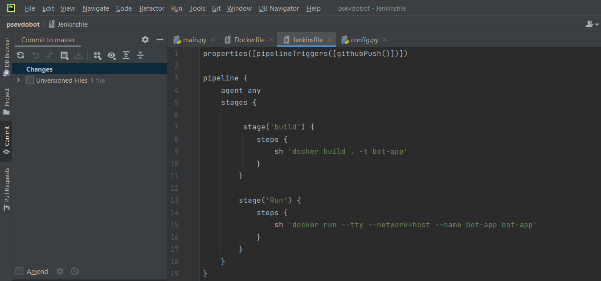  
It's still not properly a pipeline, because after run docker will be working, until break,
so after break it is must be part with wiping out (stop container, delete container and image)  
  
Ok but the pipeline runs in Jenkins. This is bad practice. Let’s run it in some node  
let’s create Permanent Agent on AWS EC2  
create EC2 Ubuntu instance with t2.micro on free tier  
  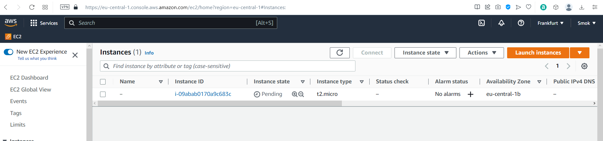
  
Setup environment on server for an agent to work properly  
  install Docker and Java 11  
  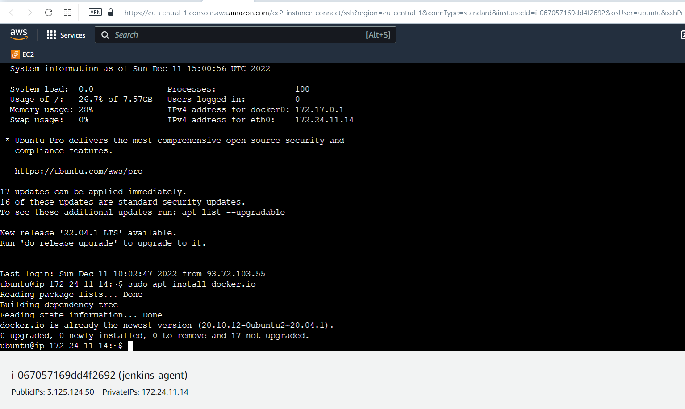 
  
Then, save ssh keys from AWS to get an access EC2 instance from Jenkins  
And setup a new agent on Jenkins  
  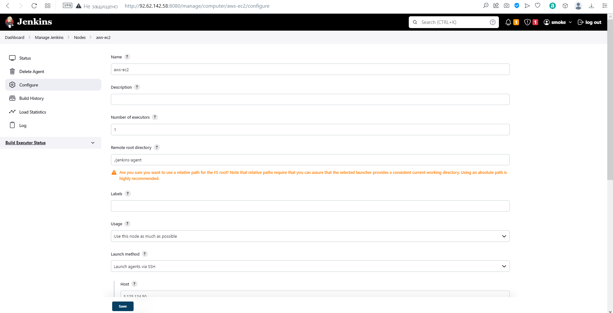  
    
  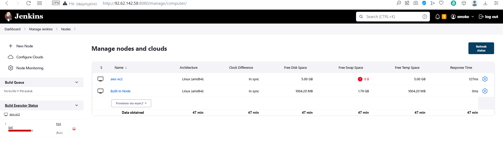  
  
Set Number of executors to 0 on build-in node for preventing running jobs on it  
  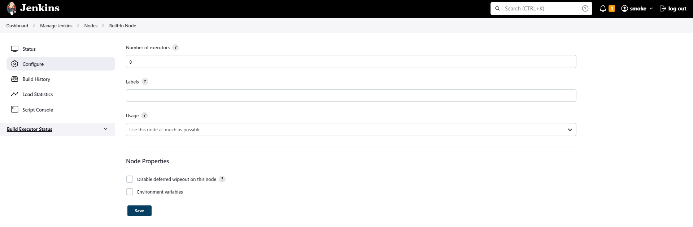  
  
Start manual build  
Everything is OK, the application works well
  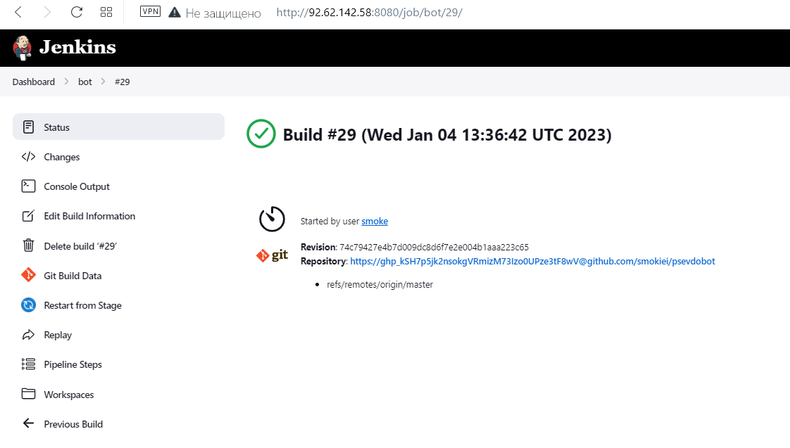  
  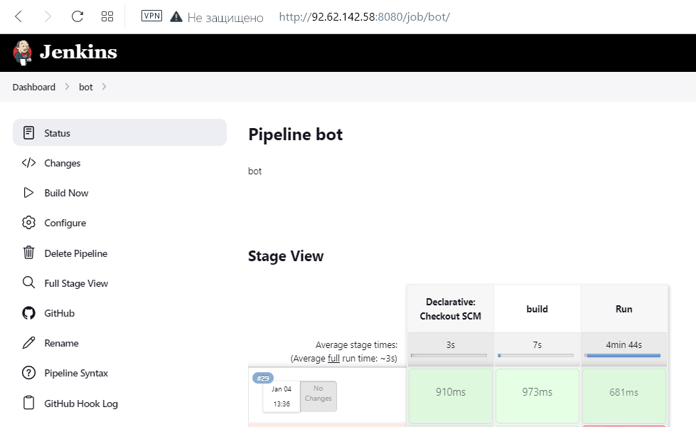  
  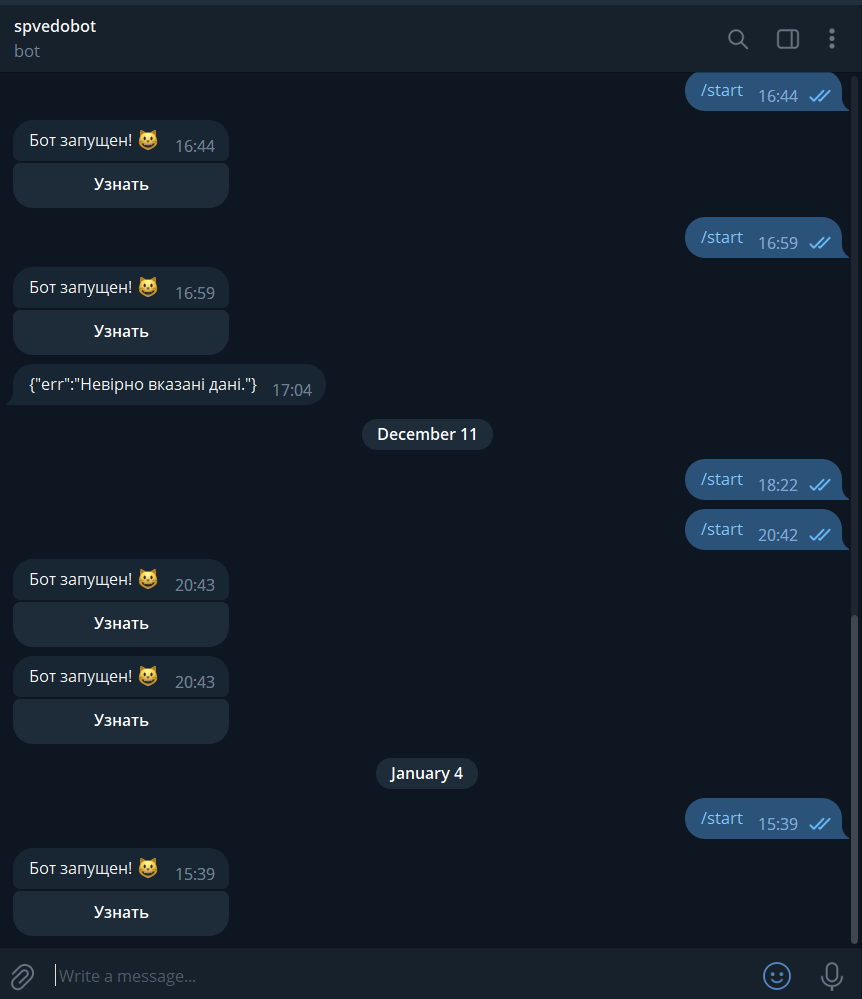  
This is not a perfect pipeline, it needs a manual wipe (stop container and remove iamge) - it will be improved in future
and try to automate Jenkins agent deployment

  
