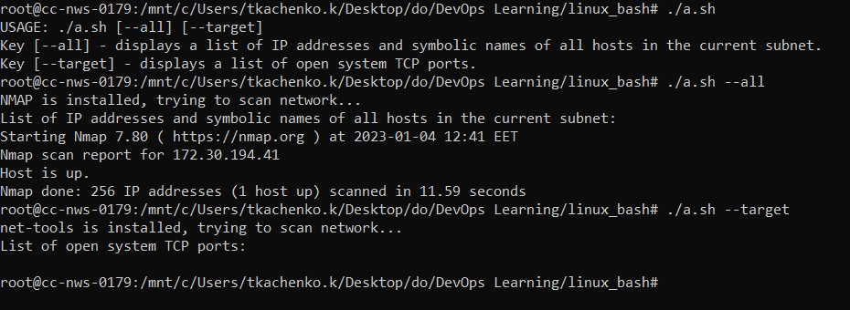
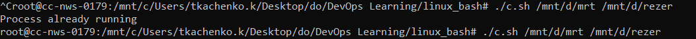

#### Linux administration with bash
[Script for task A](./a.sh)  
sample execution  
 

[Script for task B](./b.sh)  
[sample result file](./outfile.txt)   

[Script for task C](./c.sh)  
sample execution  
  
[sample log file](./backuplog.txt)   