#### Linux Networking
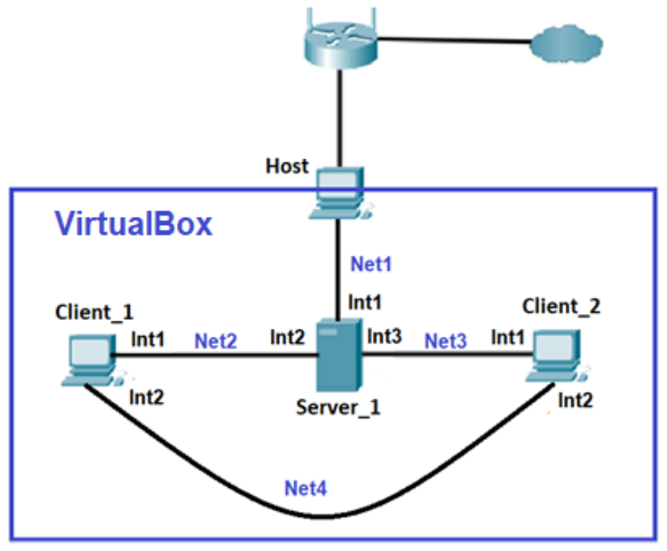  
 * Адреса мережі Net1 - 192.168.171.0/24  
 * Адреса мережі Net2 – 10.84.25.0/24  
 * Адреса мережі Net3 – 10.12.84.0/24  
 * Адреса мережі Net4 – 172.16.25.0/24  
  
virtual machine Server_1 (name: Ubuntu)  
  - int1 ens33 (DHCP)
  - int2 ens36 10.84.25.1  
  - int3 ens38 10.12.84.1  
virtual machine Client_1 (name: vm2)  
  - int1 ens33 (DHCP)
  - int2 ens36 172.16.25.1
virtual machine Client_2 (name: vm3) 
  - int1 ens33 (DHCP)
  - int2 ens36 172.16.25.5  

################ 
1. На Server_1 налаштувати статичні адреси на всіх інтерфейсах.


2. На Server_1 налаштувати DHCP сервіс, який буде конфігурувати адреси Int1 Client_1 та Client_2
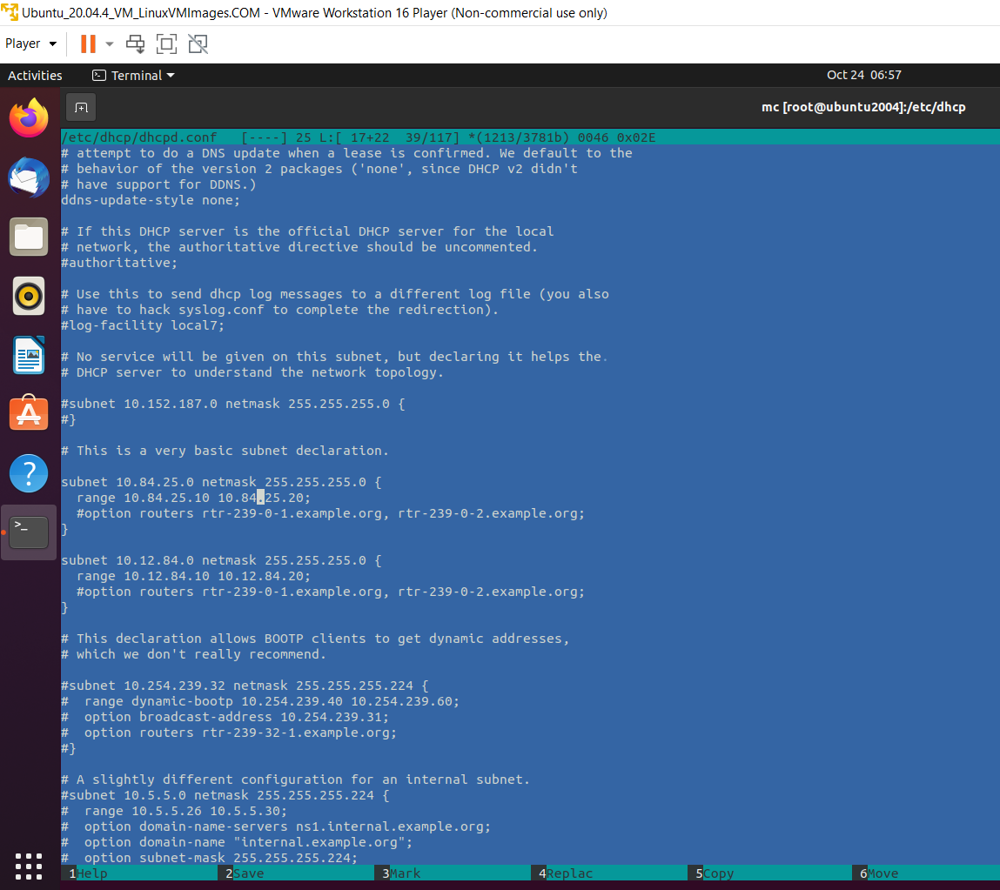

3. За допомогою команд ping та traceroute перевірити зв'язок між віртуальними машинами. Результат пояснити.
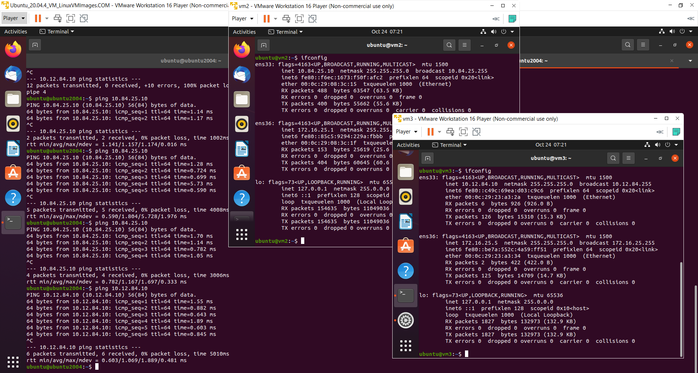
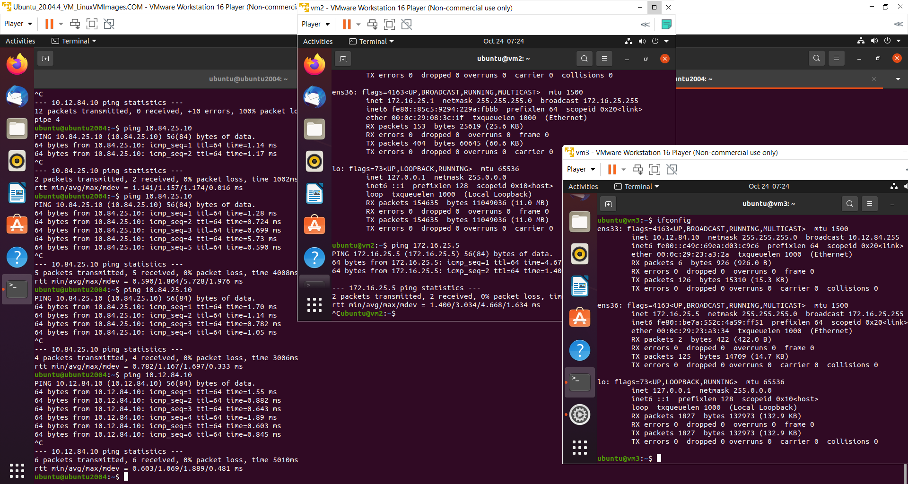
пояснення: перевірка пройшла успішно

4. На віртуальному інтерфейсу lo Client_1 призначити дві ІР адреси за таким правилом: 172.17.D+10.1/24 та 172.17.D+20.1/24. Налаштувати маршрутизацію таким чином, щоб трафік з Client_2 до 172.17.D+10.1 проходив через Server_1, а до 172.17.D+20.1 через Net4. Для перевірки використати traceroute.
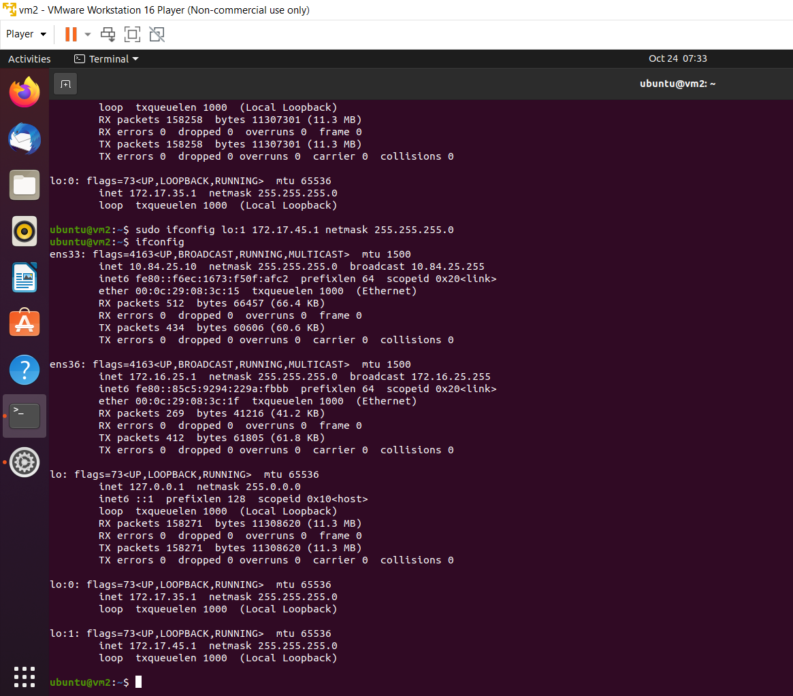
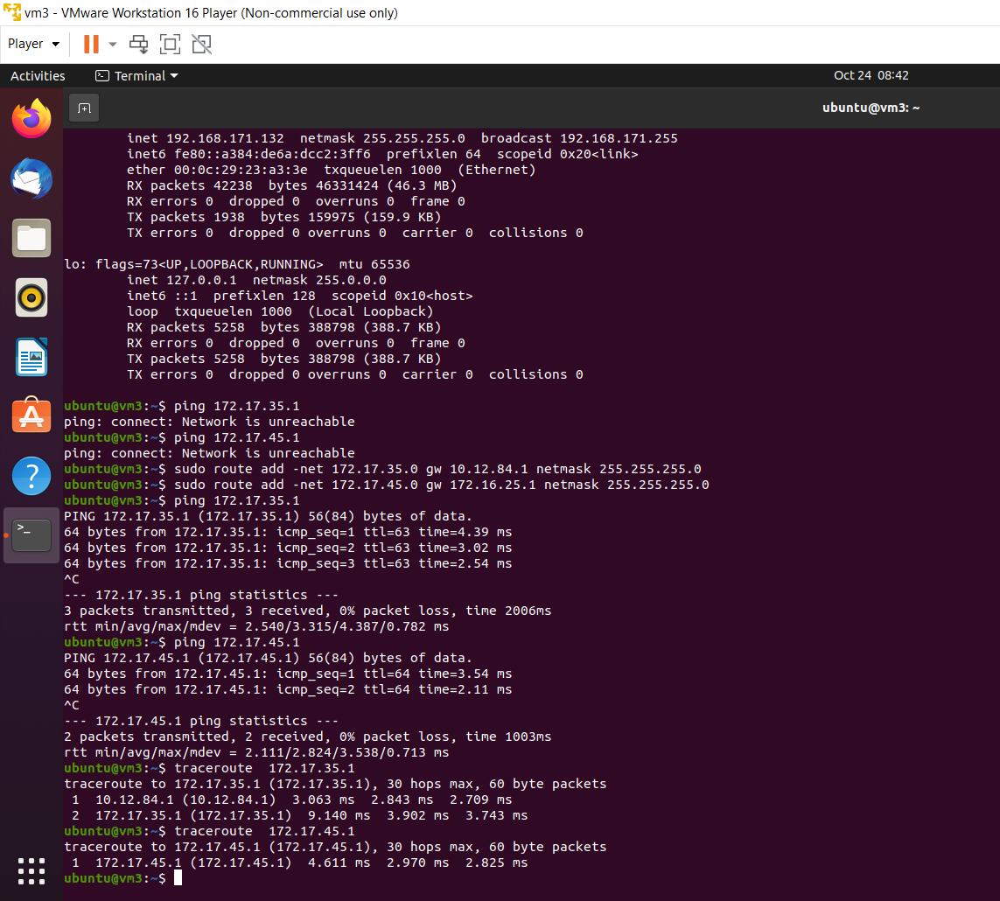

5. Розрахувати спільну адресу та маску (summarizing) адрес 172.17.D+10.1 та 172.17.D+20.1, при чому префікс має бути максимально можливим. Видалити маршрути, встановлені на попередньому кроці та замінити їх об’єднаним маршрутом, якій має проходити через Server_1.
розрахунок:
```
10101100.00010001.00100011.00000001 (172.17.35.1) &
10101100.00010001.00101101.00000001 (172.17.45.1)
10101100.00010001.00100001.00000001 = 172.17.33.1 => 172.17.32.0/20
```
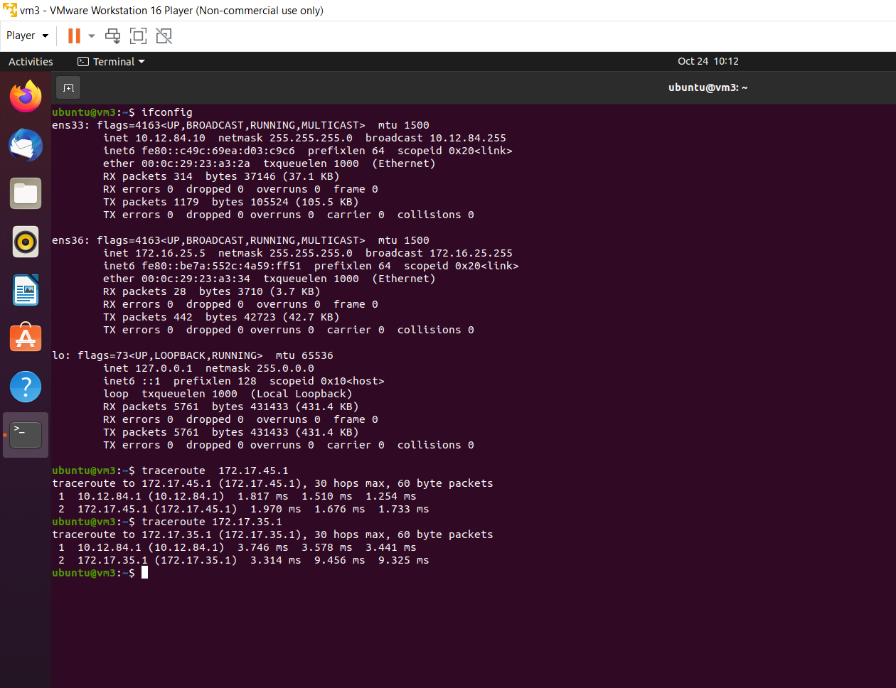

6. Налаштувати SSH сервіс таким чином, щоб Client_1 та Client_2 могли підключатись до Server_1 та один до одного.
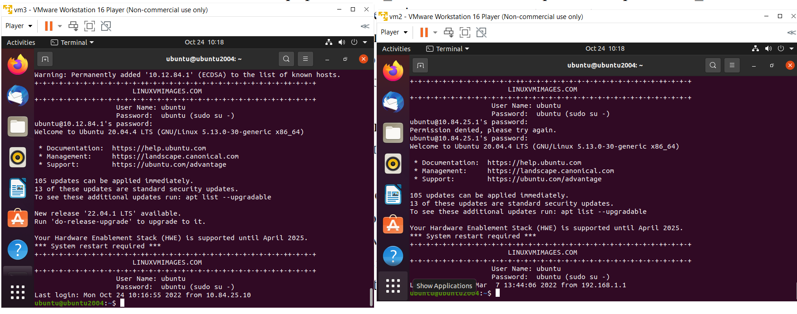
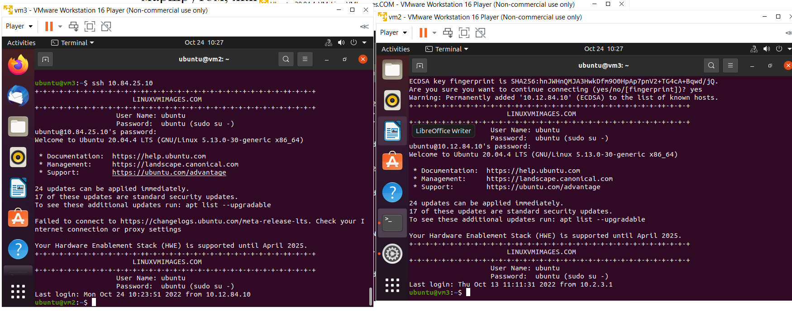

7. Налаштуйте на Server_1 firewall таким чином:
• Дозволено підключатись через SSH з Client_1 та заборонено з Client_2
• З Client_2 на 172.17.D+10.1 ping проходив, а на 172.17.D+20.1 не проходив
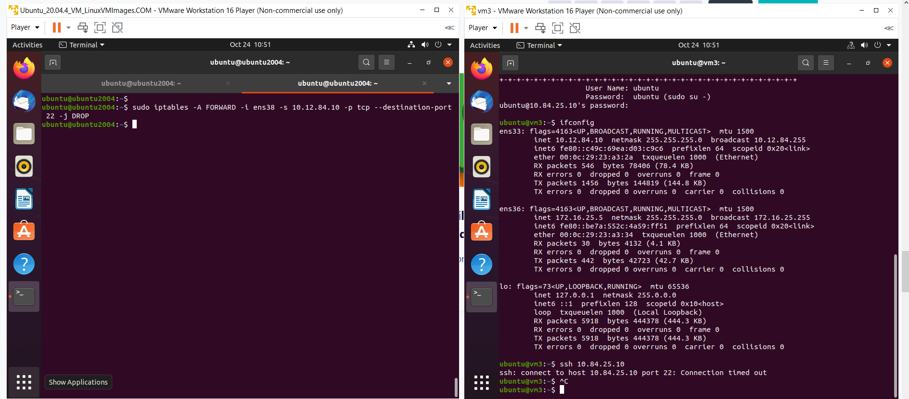
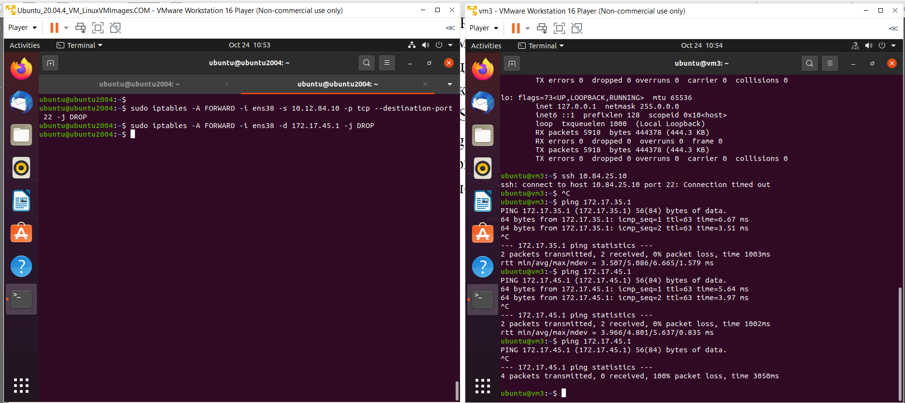

8. Якщо в п.3 була налаштована маршрутизація для доступу Client_1 та Client_2 до мережі Інтернет – видалити відповідні записи. 
На Server_1 налаштувати NAT сервіс таким чином, щоб з Client_1 та Client_2 проходив ping в мережу Інтернет
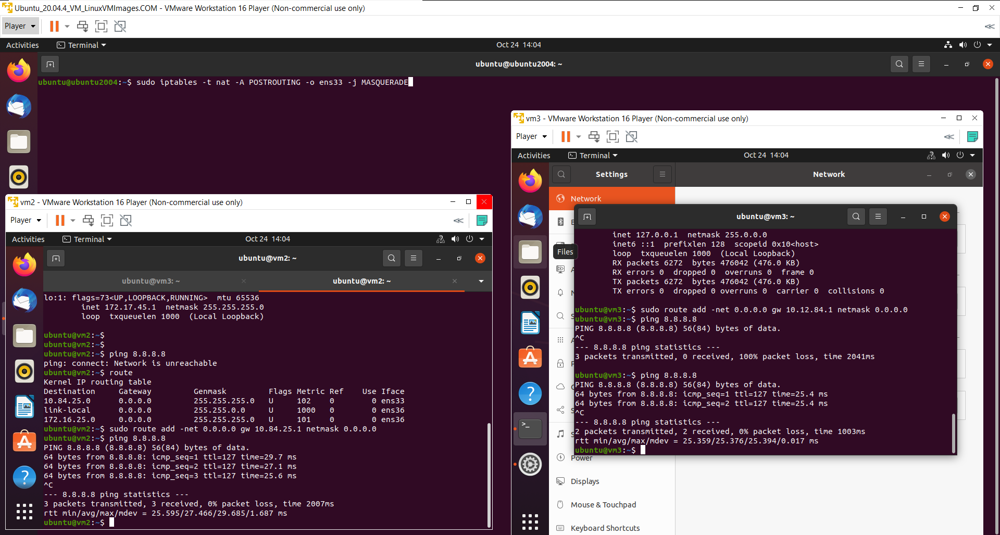