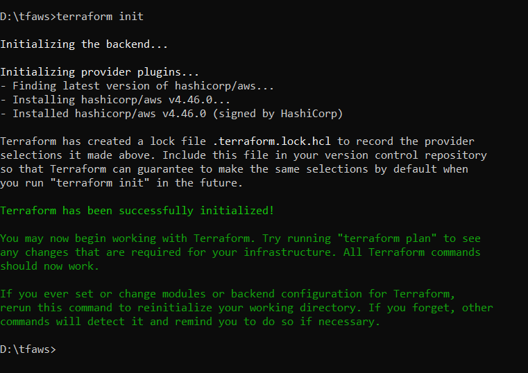
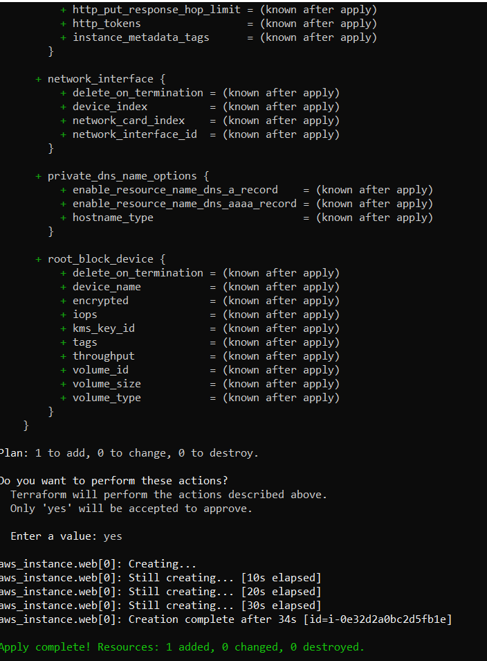
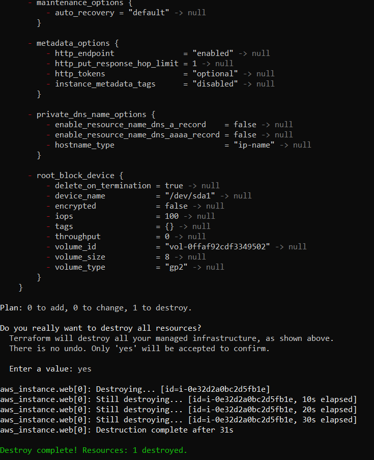

# Terraform 
create (./main.tf) like sample with actual Ubuntu ami
run Terraform init  
  
  
run Terraform plan  
    

run Terraform apply  
    

Check AWS - instance created  
   

dont forger terraform destroy  
  

Check AWS - instance destroyed  
  

Do some changes, commit them and push to github. Check what happens. Great! Its work!
  
