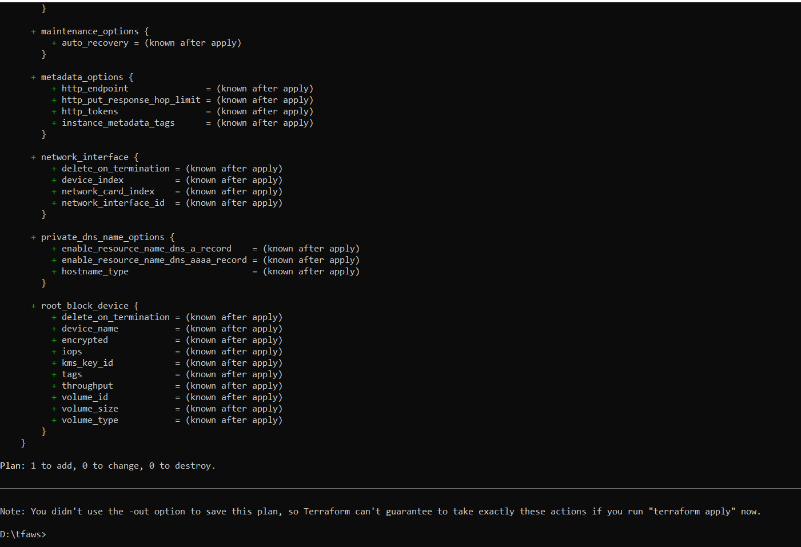
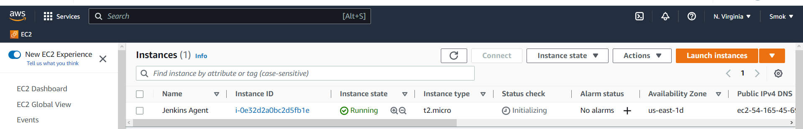
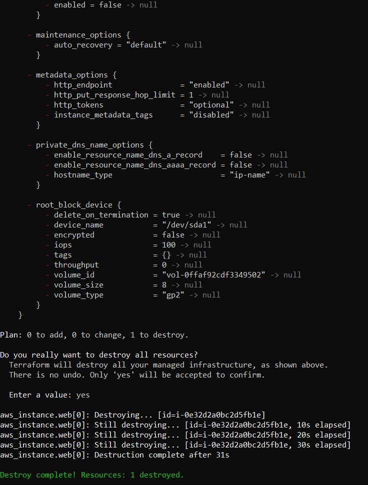

# Terraform 
create (./main.tf) like sample with actual Ubuntu ami
run Terraform init
  
  
run Terraform plan
    

run Terraform apply
    

Check AWS - instance created
   

dont forger terraform destroy 
  

Check AWS - instance destroyed
  

Do some changes, commit them and push to github. Check what happens. Great! Its work!
  

Ok lets run application in docker. Create Dokerfile
  
  and do some refactor with Jenkinsfile
  
Its stell not properly pipeline, because after run docker will be working, until break, 
so after break it is must be script with wiping out (stop container, delete container and image)

Ok but pipeline run in Jenkins. This is bad practice. Lets run it in some node
lets create Permanent Agent on AWS EC2
create EC2 Ubuntu instance with t2.micro on free tier
  

Setup environment on server for agent work properly
  install Docker and Java 11
   

Then, save ssh keys from AWS to access EC2 insta from Jenkins
And setup new agent on Jenkins
   
   
   

Set Number of executors to 0 on build-in node for preventing running jobs on it 
   

Start manual build - all OK! application work well
   
   

This is not perfect pipeline, its need manual break - it will be improved in future
and try to automate Jenkins agent deployment

  install Docker Pipeline plugin 
  
  and refactor Jenkinsfile

  
